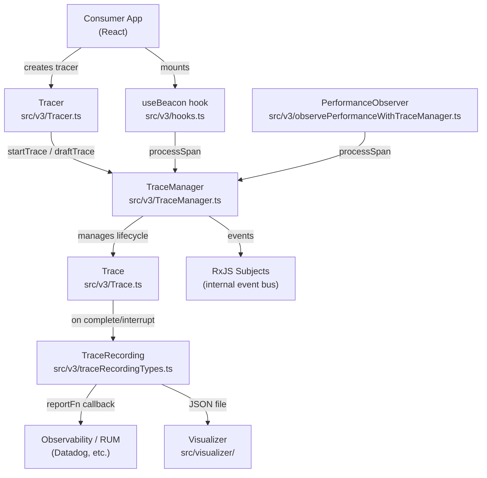

# retrace — Architecture

## System Overview

`@zendesk/retrace` is a published TypeScript library (dual CJS + ESM) that instruments frontend applications with Product Operation Traces. It captures browser performance entries, React component render spans, and custom spans into a structured `TraceRecording`, which can be forwarded to observability services (e.g., Datadog RUM) or downloaded for local debugging. The library ships two major APIs: a v3 `TraceManager`/`Tracer` system and a legacy v1 `generateTimingHooks` React hooks API.

## Architecture Diagram

## Directory Map

| Path | Responsibility | Notes |
|------|---------------|-------|
| `src/main.ts` | Public API surface — all library exports | Single entry point |
| `src/v3/TraceManager.ts` | Central singleton; receives spans, manages active `Trace` | One trace active at a time |
| `src/v3/Tracer.ts` | Per-definition handle; creates `Trace` instances via `TraceManager` | Created per operation definition |
| `src/v3/Trace.ts` | Lifecycle of a single operation trace | States: draft → active → complete/interrupted |
| `src/v3/hooks.ts` | `generateUseBeacon` — React hook that emits render spans | Used in consumer components |
| `src/v3/types.ts` | Core type definitions: `TraceDefinition`, `RelationSchemas`, etc. | Generic over `RelationSchemasT` |
| `src/v3/spanTypes.ts` | Span type unions and input types | Component render, perf entry, error |
| `src/v3/matchSpan.ts` | Span matching DSL (`match.*` helpers) | Used in trace definitions |
| `src/v3/traceRecordingTypes.ts` | Output shape: `TraceRecording`, `RecordedSpan` | Serializable JSON |
| `src/v3/convertToRum.ts` | Converts `TraceRecording` to RUM-compatible format | Datadog RUM integration helper |
| `src/v3/firstCPUIdle.ts` | CPU idle / TTI computation algorithm | Based on Long Tasks / Long Animation Frames |
| `src/v3/observePerformanceWithTraceManager.ts` | Wires `PerformanceObserver` to `TraceManager` | Auto-ingests browser perf entries |
| `src/v3/ConsoleTraceLogger.ts` | Debug logger that prints traces to console | Dev/testing utility |
| `src/v3/TraceManagerDebugger.tsx` | React component for in-app trace visualization | Dev overlay |
| `src/v3/testUtility/` | Test helpers: mock factory, ASCII timeline serializer | Test-only |
| `src/v3/docs/` | Design docs: model overview, TTI, FCI, crumbs | Reference docs |
| `src/v1/` | Legacy `generateTimingHooks` / `useTiming` API | Stable; new work goes in v3 |
| `src/visualizer/` | Standalone React app for visualizing trace JSON files | Storybook-hosted |
| `src/stories/` | Storybook stories and mock app components | Dev examples |
| `src/ErrorBoundary.tsx` | `ReactMeasureErrorBoundary` + `useOnErrorBoundaryDidCatch` | Integrates errors into traces |
| `.storybook/` | Storybook configuration | Dev only |
| `scripts/` | Release utilities (TOTP-based npm publish) | CI/CD only |

## Key Design Decisions

### Single Active Trace
Only one `Product Operation Trace` can be active at a time in a `TraceManager` instance. A new trace starting automatically interrupts the previous one. This simplifies span attribution but means care is needed around concurrent operations.

### Generic over `RelationSchemasT`
The entire v3 API is generic over a `RelationSchemasBase` type parameter that describes the relations a trace can carry (e.g., `{ ticket: { ticketId: Number } }`). This provides full type-safety for span matching and relation lookups with zero runtime overhead.

### RxJS for Internal Events
`TraceManager` uses RxJS `Subject`s as an internal event bus (`trace-start`, `state-transition`, `required-span-seen`, `add-span-to-recording`, `definition-modified`). This decouples event production from consumption and enables the debugger/logger to subscribe without coupling.

### Dual Build: CJS + ESM
The library is built as both CommonJS (`cjs/`) and ESM (`esm/`) via TypeScript compiler + Webpack. The ESM build uses a custom Webpack plugin (`PostProcessChunkWebpackPlugin`) to rename `__webpack_require__` to avoid conflicts in host app bundlers.

### v1 vs v3 APIs
- **v1** (`generateTimingHooks`, `useTiming`): legacy React hooks API, TTI/TTR focused, simpler interface. Still supported for existing consumers.
- **v3** (`TraceManager`, `Tracer`, `useBeacon`): full Product Operation Trace model with relations, computed spans, RUM export, parent/child traces, and a visualizer.

## Data Flow

1. Consumer calls `tracer.start({ relatedTo, variant })` on a user event
2. `TraceManager` creates a `Trace` instance and sets it as active
3. React components with `useBeacon` emit `component-render-start` / `component-render` spans on each render
4. `PerformanceObserver` (via `observePerformanceWithTraceManager`) feeds browser perf entries as spans
5. Each span is matched against the active trace's `requiredSpans` and `interruptionCriteria`
6. When all required spans are seen (debounce settles), the trace transitions to `complete`
7. A `TraceRecording` is generated and passed to the consumer's `onTraceEnd` / `reportFn` callback
8. Consumer forwards the recording to Datadog RUM or other observability backend

## External Dependencies

| Package | Purpose |
|---------|---------|
| `rxjs` | Internal event bus in `TraceManager` (only runtime dependency) |
| `react` / `react-dom` | Peer dependency — beacon hooks require React |
| Webpack | ESM bundle build (dev dependency) |
| Vitest | Test runner for v3 and visualizer |
| Storybook | Interactive dev/demo environment |
| semantic-release | Automated versioning and NPM publish |
| `@visx/*` | Visualizer charting components (dev only) |
| `@zendeskgarden/*` | Visualizer UI components (dev only) |

## Cross-Cutting Concerns

### Configuration
No runtime config object — all behavior is configured through `TraceDefinition` objects passed to `Tracer` constructor, and `TraceManagerConfig` passed to `TraceManager` constructor.

### Observability
The library _is_ the observability tool. It emits `TraceRecording` JSON which consumers route to their preferred backend. The `ConsoleTraceLogger` and `TraceManagerDebugger` are available for local development.

### Error Handling
- `ReactMeasureErrorBoundary` catches React render errors and injects them as error spans into active traces
- Span processing errors are non-fatal; they are reported via the optional `reportErrorFn` in `TraceManagerConfig`
